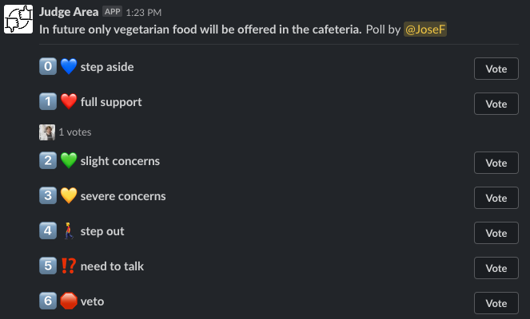
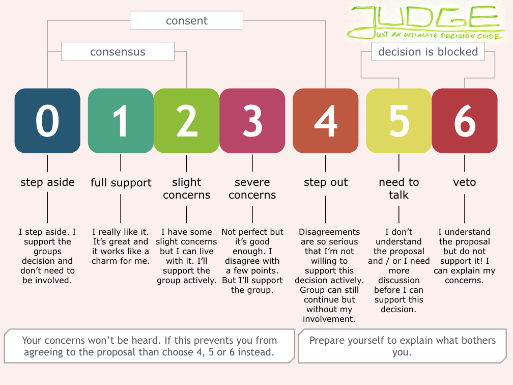

# JUDGE Arena Bot

How to take good decisions in equitable groups? In place of discussing until all group members have reached consensus, 
it is often better to make decisions based on the principle of "consent" (https://en.wikipedia.org/wiki/Sociocracy#Consent_vs._consensus).
A blog article from "Komplexitäter" (only German: https://www.komplexitaeter.de/inspiration/effektive-entscheidungen-in-gruppen/) 
describes a tool for consent decisions: JUDGE – Just an Ultimate Decision Guide. The JUDGE Area Bot is an implementation 
of the JUDGE concept as a Slack Bot.

## Usage

Take a poll with the bot: What should be decided? 

```
/judge In future only vegetarian food will be offered in the cafeteria. 
```

Then all members of the slack channel can vote.




We use the following scale to measure the resistances of the group: 



## Build & deployment

### Build with Maven wrapper

```
./mvnw clean package 
```

### Deploy in Google App Engine

Create local file `src/main/webapp/WEB-INF/appengine-web.xml` and define your Slack verification token & Slack API OAuth
Access Token.

```
<appengine-web-app xmlns="http://appengine.google.com/ns/1.0">
    <env-variables>
        <env-var name="SLACK_TOKEN" value="INSERT_YOUR_TOKEN_HERE" />
        <env-var name="SLACK_API_TOKEN" value="INSERT_YOUR_OAUTH_TOKEN_HERE" />
    </env-variables>
</appengine-web-app>
```

Deploy app with App Engine-Maven-Plug-in 

```
./mvnw appengine:deploy -Dapp.deploy.projectId=<INSERT_YOUR_PROJECTID_HERE> -Dapp.deploy.version=<INSERT_YOUR_VERSION_HERE>
```